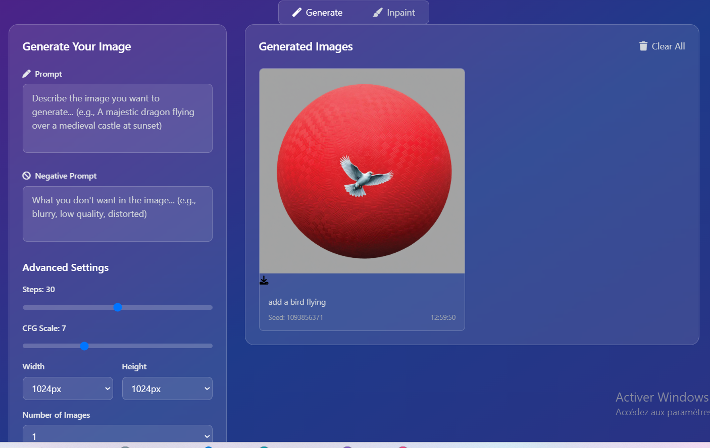
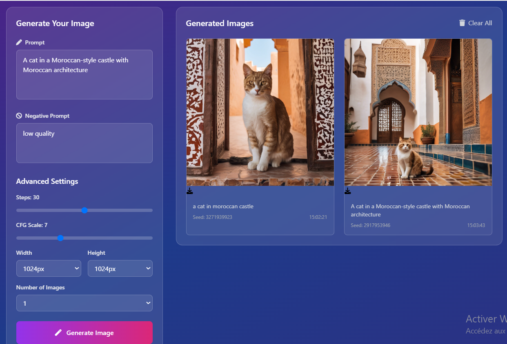

# AI Image Generator - Stability AI

A beautiful, modern web interface for generating images using Stability AI's powerful text-to-image API. Built with Node.js, Express, and a stunning frontend with Tailwind CSS.


## ✨ Features

- 🎨 **Beautiful Modern UI** - Glass morphism design with gradient backgrounds
- 🚀 **Real-time Image Generation** - Generate images using Stability AI's SDXL model
- ⚙️ **Advanced Controls** - Fine-tune generation parameters (steps, CFG scale, size)
- 📱 **Responsive Design** - Works perfectly on desktop, tablet, and mobile
- 💾 **Image Download** - Download generated images with one click
- 🎯 **Negative Prompts** - Specify what you don't want in your images
- 🔄 **Multiple Images** - Generate 1-4 images at once
- 📊 **Generation Info** - View seed values and generation timestamps
- 🎭 **Smooth Animations** - Beautiful loading and success animations

## 🛠️ Technology Stack

- **Backend**: Node.js, Express.js
- **Frontend**: HTML5, CSS3, JavaScript (ES6+)
- **Styling**: Tailwind CSS
- **API**: Stability AI REST API
- **Icons**: Font Awesome
- **Fonts**: Inter (Google Fonts)

## 📋 Prerequisites

- Node.js 18+ installed on your system
- A Stability AI API key (get one at [platform.stability.ai](https://platform.stability.ai/account/keys))

## 🚀 Quick Start

### 1. Clone or Download

```bash
# If you have this as a repository
git clone <repository-url>
cd image-generator-using-stability

# Or simply download and extract the files
```

### 2. Install Dependencies

```bash
npm install
```

### 3. Configure API Key

Create a `.env` file in the root directory:

```bash
# Copy the example file
cp env.example .env
```

Edit the `.env` file and add your Stability AI API key:

```env
STABILITY_API_KEY=your_actual_api_key_here
PORT=3000
```

### 4. Build CSS (Optional)

If you want to modify the styles, build the CSS:

```bash
npm run build-css
```

### 5. Start the Server

```bash
# Development mode with auto-restart
npm run dev

# Or production mode
npm start
```

### 6. Open in Browser

Navigate to `http://localhost:3000` in your web browser.

## 🎯 Usage Guide

### Basic Image Generation

1. **Enter a Prompt**: Describe the image you want to generate
   - Example: "A majestic dragon flying over a medieval castle at sunset"
   - Be specific and descriptive for better results

2. **Optional Negative Prompt**: Specify what you don't want
   - Example: "blurry, low quality, distorted, ugly"

3. **Adjust Settings** (optional):
   - **Steps**: Higher values (30-50) = better quality but slower
   - **CFG Scale**: Controls how closely the image follows your prompt (7-12 recommended)
   - **Size**: Choose from 1024px, 1152px, or 1344px
   - **Number of Images**: Generate 1-4 variations

4. **Click Generate**: Watch your image come to life!

### Advanced Tips

- **Better Prompts**: Use descriptive adjectives, specify art styles, lighting, composition
- **Negative Prompts**: Help avoid common issues like blur, artifacts, poor quality
- **Seed Values**: Each generated image has a seed - you can use this for reproducible results
- **Multiple Images**: Generate several variations to choose the best one

## 🎭 Inpainting Feature

The application also supports advanced inpainting functionality, allowing you to modify specific parts of existing images while keeping the rest intact.

### How Inpainting Works

1. **Upload an Image**: Switch to "Inpaint Mode" and upload your source image
2. **Paint the Mask**: Use the brush tool to mark areas you want to modify (painted areas will be replaced)
3. **Enter Prompt**: Describe what you want to see in the masked areas
4. **Generate**: Watch as AI seamlessly replaces only the masked regions

### Inpainting Examples

#### Before Inpainting

*Original image before inpainting*

#### After Inpainting

*Result after inpainting with AI-generated content*

### Inpainting Tips

- **Precise Masking**: Only paint over areas you want to change
- **Clear Prompts**: Be specific about what should replace the masked area
- **Edge Blending**: The AI automatically blends edges for natural-looking results
- **Multiple Attempts**: Try different prompts or mask sizes for varied results

### Inpainting Controls

- **Brush Size**: Adjust the painting brush size for precise or broad strokes
- **Clear Mask**: Remove all painted areas to start over
- **Undo**: Step back through your painting actions
- **Prompt Settings**: Same advanced controls as text-to-image generation

## 🔧 Configuration Options

### Environment Variables

| Variable | Description | Default |
|----------|-------------|---------|
| `STABILITY_API_KEY` | Your Stability AI API key | Required |
| `PORT` | Server port | 3000 |

### API Parameters

| Parameter | Range | Default | Description |
|-----------|-------|---------|-------------|
| `steps` | 10-50 | 30 | Number of denoising steps |
| `cfg_scale` | 1-20 | 7 | How closely to follow the prompt |
| `width` | 1024, 1152, 1344 | 1024 | Image width in pixels |
| `height` | 1024, 1152, 1344 | 1024 | Image height in pixels |
| `samples` | 1-4 | 1 | Number of images to generate |

## 📁 Project Structure

```
image-generator-using-stability/
├── public/                 # Static files
│   ├── index.html         # Main HTML file
│   ├── styles.css         # Compiled CSS
│   └── script.js          # Frontend JavaScript
├── src/
│   └── input.css          # Tailwind CSS input
├── server.js              # Express server
├── package.json           # Dependencies and scripts
├── tailwind.config.js     # Tailwind configuration
├── env.example            # Environment variables example
└── README.md              # This file
```

## 🎨 Customization

### Styling

The interface uses Tailwind CSS with custom styles. To modify:

1. Edit `src/input.css` for custom CSS
2. Edit `public/styles.css` for additional styles
3. Run `npm run build-css` to rebuild

### Adding Features

- **New Models**: Modify the API endpoint in `server.js`
- **Additional Parameters**: Add new form fields and update the API call
- **UI Enhancements**: Modify the HTML and CSS files

## 🔒 Security Notes

- Never commit your `.env` file to version control
- The API key is stored server-side only
- All API calls are proxied through your server for security

## 🐛 Troubleshooting

### Common Issues

1. **"API key not configured"**
   - Make sure you have a `.env` file with your `STABILITY_API_KEY`
   - Verify your API key is valid at [platform.stability.ai](https://platform.stability.ai/account/keys)

2. **"Failed to generate image"**
   - Check your internet connection
   - Verify your API key has sufficient credits
   - Try a simpler prompt

3. **Images not loading**
   - Check browser console for errors
   - Verify the server is running on the correct port
   - Clear browser cache

4. **Styling issues**
   - Run `npm run build-css` to rebuild the CSS
   - Check that `public/styles.css` exists and is being served

### Getting Help

- Check the browser console for JavaScript errors
- Check the server console for backend errors
- Verify your Stability AI account has available credits

## 📄 License

This project is open source and available under the [MIT License](LICENSE).

## 🙏 Acknowledgments

- [Stability AI](https://stability.ai/) for providing the powerful image generation API
- [Tailwind CSS](https://tailwindcss.com/) for the beautiful styling framework
- [Font Awesome](https://fontawesome.com/) for the icons
- [Inter Font](https://rsms.me/inter/) for the typography

## 🤝 Contributing

Contributions are welcome! Please feel free to submit a Pull Request.

---

**Happy Image Generating! 🎨✨** 


